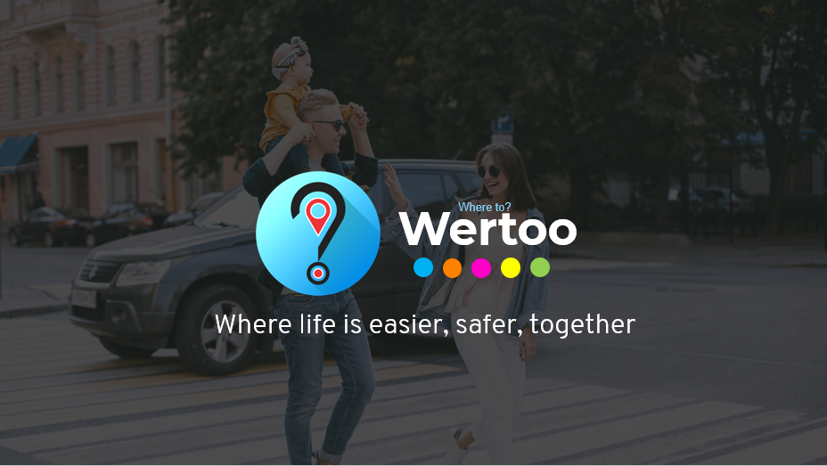

# Forkwell Coronavirus Hack: Virus Combat

Hi, Thank you for visiting. This project is made by Dr Quantum. We are participating in competition organised by Forkwell. The competition titled, Forkwell coronavirus hack. We are taking topic 2 which is VIRUS COMBAT as our challenge.

## Team Members

- [Linkedin](https://www.linkedin.com/in/firdaus-j-4677a6124/) : Muhammad Firdaus bin Jamdi : https://github.com/firdausjamdi
- [Linkedin](https://www.linkedin.com/in/mdaliakbar98/) : Muhammad Ali Akbar bin Radzali : https://github.com/H0j3n
- [Linkedin](https://www.linkedin.com/in/kaitorque/) : Muhammad Idham bin Idris : https://github.com/kaitorque
- [Linkedin](https://www.linkedin.com/in/sofea-hazirah-ishak-667428197/) : Sofea Hazirah bt Ishak : https://github.com/aefos27
- [Linkedin](https://www.linkedin.com/in/nur-khadijah-safiy-6427a8182/) : Nur Khadijah Safiy bt Mohamad Radzi : https://github.com/KhadijahSafiy

## Prototype
- [Link to Prototype](https://www.figma.com/proto/nIsg2chNvvzkY1AnwRKiWs/Virus-Combat?node-id=64%3A358&scaling=min-zoom)

## Introduction

Due to the pandemic, social distancing is vital to prevent the infection of Covid-19. We believe, This practice will be continue even after the movement control order (MCO) because we’re not as free of infection risk as we were before. We are thinking life after outbreak.

We develop a prototype of a mobile application that is called Wertoo or "where too?" The application is solution for public to facilitate their decision when going outside. Providing such extensive visualisation of crowd, getting report from crowdsourcing and identify the service provided at a particular premises.
  

## Features

## Extra 

