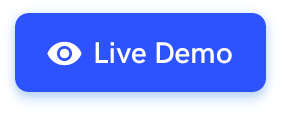

<h1 align="center" style="border-bottom: none !important; margin-bottom: 5px !important;"><a href="https://designrevision.com/downloads/shards-dashboard-lite-react/">COVNECT</a></h1>

  

A prototype platform that connects people to their nearest health care institutions safely & seamlessly, reducing the bottleneck and overwhelming responsibilities that our health-care workers face. This project is submitted for the Forkwell Coronavirus Hack.

  

### Built using
- [Reactjs](https://reactjs.org/)
- [Material UI](https://material-ui.com/)
- [Netlify](https://firebase.google.com/)
- [Microsoft Azure](https://azure.microsoft.com/en-us/)

